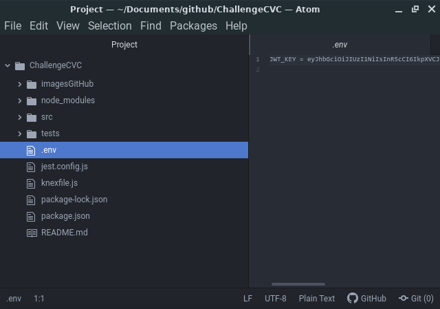

# Sobre o projeto:

É um projeto voltado para a autenticação de usuários comuns e administradores, o qual possuem previlégios iguais em determinadas rotas e diferenciados em outras. Os usuários comuns podem acessar a mesma rota de home, a qual deseja boas vindas a todos eles, junto aos usuários administradores. Porém apenas os usuários administradores podem acessar a lista de todos os usuários cadastrados.

Pacotes usados:

- express -> Para criar um servidor e fazer requisições a ele.

- body-parser -> Para manipular objetos json.

- cors -> Permissão de endpoints que podem acessar a api.

- knex -> Transformar códigos JS em comandos SQL.

- jsonwebtoken -> Gerar token de autenticação.

- bcrypt -> para encriptar a senha dos usuários cadastrados.

- sqlite3 -> Armazenar os dados do usuário.

- Jest -> Para realizar os testes automatizados.

- Supertest -> Para realizar teste em rotas.

# Observações:

**É necessário que você crie um arquivo .env(variável de ambiente), para a chave de autenticação do usuário, a mesma não vai junto com o código por questões de segurança. Esse arquivo é colocado no .gitignore, então o github o ignora e quando baixado esse repositório, o mesmo não estará junto dos outros arquivos.**

- Na raiz do projeto crie um novo arquivo nomeado como .env, como mostra na foto abaixo:



- Nesse arquivo você coloca a chave e o valor, a chave por padrão desse projeto será nomeada como JWT_KEY.

**Código que deve está no arquivo:**

```
JWT_KEY = a chave você escolhe
```

# Estrutura do projeto:

- src -> Aqui é a pasta principal que armazena todas as outras.
  - controllers -> Fica responsável pelas funções que interagem com o usuário, requisitando-o informações e devolvendo-o respostas. Ademais, Tem conexão direta com as rotas.

    - AllUsers -> Guarda os arquivos que tem interação com todos os usuários, como login e a página de boas vindas.
      - Login.js
      - WelcomeUser.js

    - UsersAdm -> Guarda os arquivos que tem interação apenas com os usuários administradores, como o cadastro do mesmo e a seleção de todos os usuários cadastrados.
      - CreateUserAdm.js
      - FindAllUsers.js

    - UsersCommom -> Guarda os arquivos que interagem apenas com o usuário comum como o seu cadastro.
      - CreateUserCommom.js

  - database -> Fica responsável por guardar os arquivos de configuração do banco de dados.

    - migrations -> Guarda todas as migrations que contêm os comandos de criações de tabelas.
    - connection.js -> Faz a conexão com o banco de dados para fornecer isso aos models.
    - db.sqlite3 -> É o banco de dados em si, o qual é gerado depois da criação das migrations.

  - middleware -> Fica responsável por armazenar os arquivos de segurança, os quais permitem os usuários realizarem determinadas ações.
    - AuthorizationAllUsers.js -> Arquivo que dá autorização a qualquer usuário.
    - AuthorizationUserAdm.js -> Arquivo que dá autorização apenas a usuários administradores.

  - models -> É a camada que fica responsável por fazer o CRUD da aplicação. Ela é usada nos controllers que fornece as informações pedidas em cada função da class. Também tem relação com a pasta database, pois envia todas essas informações para ela.
    - Users -> Model responsável por armazenar o arquivo que tem a class Users, a qual realiza o CRUD.
      - Users.js

  - routers -> Camada em que o usuário pode ter acesso através de uma url, ela fica encaminhada de se interligar com os controllers, os quais possuem as informações que o usuário deseja. Também é organizada em camadas para separar as ações do usuário administrador do usuário comum.
    - RouterMain.js -> Contêm todas as rotas.
    - AllUsers.js -> Rota em que qualquer usuário pode ter acesso caso esteja logado.
    - UsersAdm.js -> Rota em que apenas os usuários administradores podem ter acesso.
    - UsersCommom.js -> Rota em que apenas os usuários comuns podem ter acesso.

  - index.js  -> Aquivo principal, pois é onde o servidor está rodando.

- tests -> Pasta que fica responsável por realizar os testes nas rotas.
  - userAdm.test.js
  - userCommom.test.js

# Testes no projeto.

Você pode realizar os testes por meio do postman ou insomnia. Para o cadastro de usuários não necessita de nenhum software exterior, pois nessa aplicação é usado o jest, o qual fica responsável por realizar testes automatizados em apenas um comando. Então para que você possa testar as rotas de cadastro de usuários comuns e administradores, navegue até a pasta do projeto e use o seguinte comando no seu terminal:

```
yarn test ou npm run test
```

Mas caso queira testar manualmente, use um dos softwares mencionados anteriormente.

No meu caso, uso o insomnia, então irei explicar como funciona nele:
